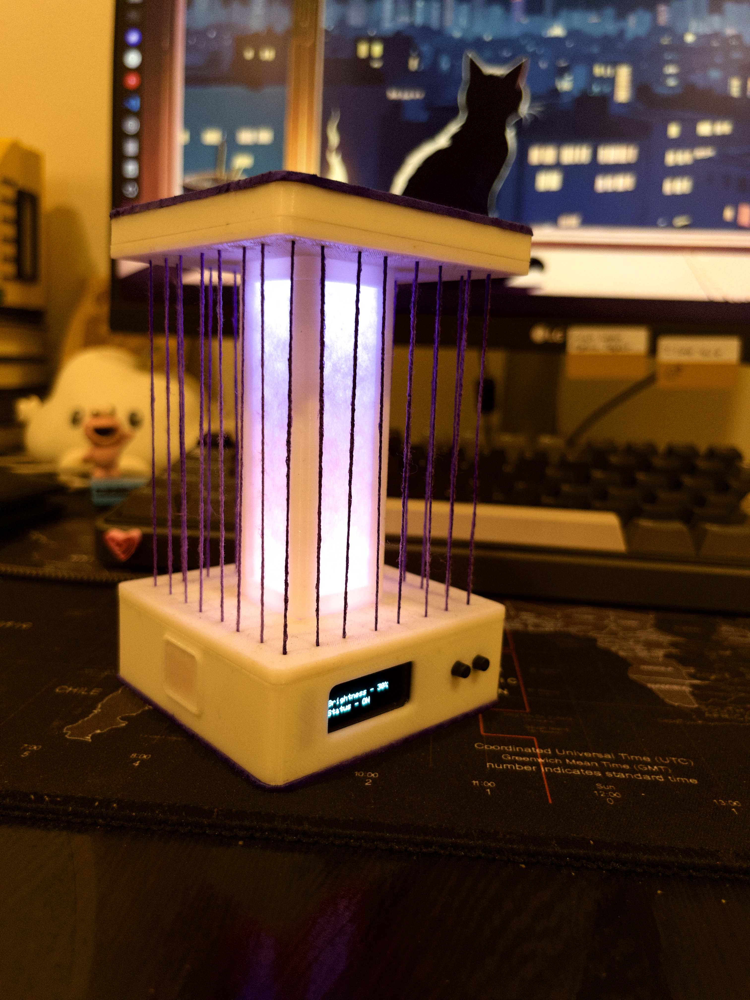
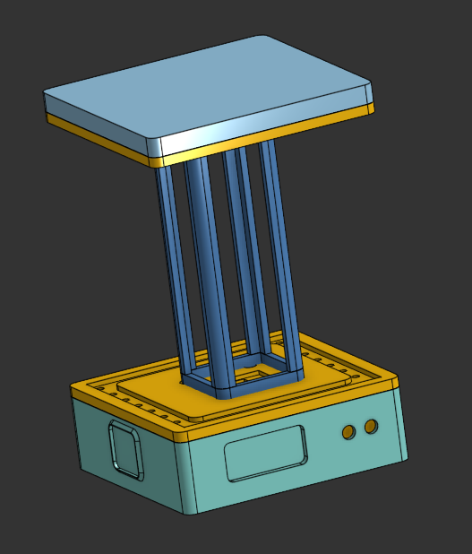

# TacaoBean

TacaoBean is a bedside lamp that combines an ESP8266-based device with an OLED display and NeoPixels, allowing users to receive and send messages through a Morse code interface. Additionally, it includes a desktop application that displays notifications based on data from a Firebase Realtime Database.


<br>


## Features

- **ESP8266 Device**:
    - Connects to Wi-Fi and fetches messages from Firebase.
    - Displays messages on an OLED screen.
    - Receives input through buttons, including Morse code input.
    - Controls NeoPixel LEDs for visual feedback.
    - Hosts a Wi-Fi Access Point for initial configuration.

- **Desktop Application**:
    - Fetches data from Firebase.
    - Displays desktop notifications when new messages are available.

## Hardware Requirements

- NodeMCU v2 (ESP8266) board.
- OLED Display (SSD1306, I2C interface).
- NeoPixel LEDs (e.g., WS2812B).
- Push buttons or touch sensors.
- Necessary wires and a breadboard or PCB.

## Software Requirements

- [PlatformIO](https://platformio.org/) for firmware development.
- [Arduino Framework](https://www.arduino.cc/en/Guide/HomePage) for ESP8266.
- Node.js and npm for the desktop application.
- Axios library for HTTP requests in the desktop application.

## Pin Configuration

| Component      | ESP8266 Pin |
|----------------|-------------|
| OLED SDA       | D2          |
| OLED SCL       | D1          |
| NeoPixel Data  | D6          |
| Select Button  | D4          |
| Type Button    | D5          |
| Touch Button   | D7          |

## Getting Started

### ESP8266 Setup

1. **Clone the Repository**:

     ```bash
     git clone https://github.com/yourusername/tacaobean.git
     ```

2. **Open the Project with PlatformIO**:

     Open the project folder `chaklilamp` in your preferred IDE with PlatformIO support, such as Visual Studio Code.

3. **Install Dependencies**:

     The required libraries are specified in the `platformio.ini` file. PlatformIO will automatically handle these dependencies.

4. **Configure Wi-Fi Credentials**:

     On first boot, the ESP8266 will start a Wi-Fi Access Point named `TacaoBean` with the password `tacaobean`.

     - Connect to this Wi-Fi network.
     - Open a web browser and navigate to `192.168.4.1`.
     - Enter your Wi-Fi SSID and Password.
     - The device will reboot and connect to your Wi-Fi network.

5. **Upload Firmware**:

     Connect the ESP8266 board to your computer and upload the firmware using PlatformIO:

     ```bash
     pio run --target upload
     ```

### Desktop Application Setup

1. **Navigate to the Desktop Application Directory**:

     ```bash
     cd Desktop/tacaobean
     ```

2. **Install Dependencies**:

     Ensure you have Node.js and npm installed. Then install the required packages:

     ```bash
     npm install
     ```

3. **Run the Application**:

     ```bash
     node tacaobean.js
     ```

     This script will periodically check Firebase for new messages and display desktop notifications.

## Firebase Configuration

Ensure that the Firebase Realtime Database is set up and accessible. The project uses the following endpoints:

- `https://your/firebase/url_message.json`
- `https://your/firebase/url_post.json`

## Additional Information

- **Morse Code Input**:

    The device allows users to input messages using Morse code through the buttons. Refer to `src/morecode.h` for the Morse code mappings used.

- **Display Interface**:

    The OLED display is used to show messages fetched from Firebase and user input.

- **LED Control**:

    The NeoPixel LEDs provide visual feedback and can be controlled through the touch button.

## License

This project is licensed under the MIT License.
